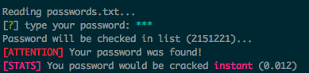

# passX

Check your passwords against a large list of commonly used passwords

### Installation

First install the dependencies and run the index.js

```
npm install && node index.js
```

### Demo



### Credits

- `passwords.txt` from [http://dazzlepod.com](http://dazzlepod.com/site_media/txt/passwords.txt) (via [wikipedia](http://en.wikipedia.org/wiki/Password))

### Licence

MIT